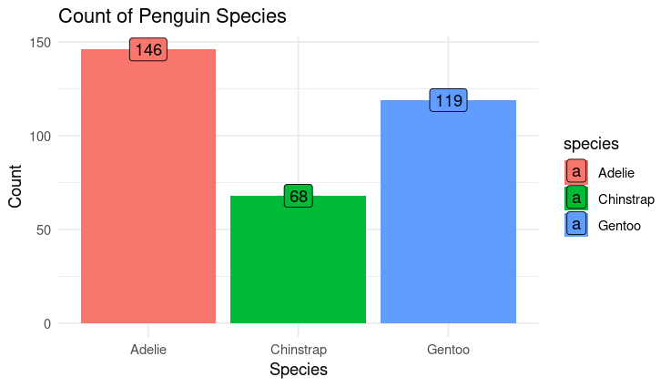

# Portfolio Projects

## Overview

This repository contains a collection of data analysis projects showcasing my expertise in SQL, R, Tableau, and Excel. Each project is accompanied by supporting files, visualizations, and detailed documentation.

---

## Projects

### **SQL**

## Data-Cleaning Steps : The data-cleaning process involved the following steps:

*   Handling missing values
*   Correcting data inconsistencies
*   Ensuring data consistency

#### 1. Car Dataset Analysis and Cleaning - BigQuery
- **Overview:** Data exploration and cleaning steps performed on a car dataset in Google BigQuery to prepare it for further analysis.
- **Tools Used:** Google BigQuery
- **Review the Data Exploration SQL Script:** [HERE](https://github.com/Bharathrdaniel/April2025/blob/ce82bbbb05d668885165d3f68c38155660f72084/cars.sql)
  - **Visual:** 
 
#### 2. NYC Trees Dataset Analysis - BigQuery
- **Overview:** Compares average tree diameters across census years (1995, 2005, and 2015) using SQL queries in BigQuery.
- **Tools Used:** Google BigQuery
- **Files:**
  - [`nyc_trees_analysis.sql`](https://github.com/Bharathrdaniel/April2025/blob/8796f3223bbf2539128f8ca5002d7193b510cbd7/Calculate%20_average_tree_diame.sql))

#### 3. US County Natality Data Analysis (2016-2018) - BigQuery
- **Overview:** Analyze county-level birth trends using SQL's `ORDER BY` clause in BigQuery.
- **Tools Used:** Google BigQuery
- **Files:**
  - [`births_analysis.sql`](https://github.com/Bharathrdaniel/April2025/blob/8796f3223bbf2539128f8ca5002d7193b510cbd7/births_analysis.sql)
  - **Visual:** 

#### 4. Employee Data Analysis with JOINs - BigQuery

- **Overview:** Explores different types of SQL JOINs (INNER, LEFT, RIGHT, FULL OUTER) using employee and department data.
- **Tools Used:** Google BigQuery
- **Files:**
  - [`employee_data_joins.sql`](https://github.com/Bharathrdaniel/April2025/blob/8796f3223bbf2539128f8ca5002d7193b510cbd7/employee_data_joins.sql)
  - **Screenshot:** 
  
The following queries were used in this analysis:

1.  **INNER JOIN:** Returns records with matching values in both tables.
2.  **LEFT JOIN:** Returns all records from the left table (employees) and matching records from the right table (Departments).
3.  **RIGHT JOIN:** Returns all records from the right table (Departments) and matching records from the left table (employees).
4.  **FULL OUTER JOIN:** Combines RIGHT JOIN and LEFT JOIN to return all matching records in both tables.

### **R Studio**

#### 1. R Sandbox Activity: Penguin Data Exploration
- **Overview:** Analyze the relationship between penguin species, flipper length, and body mass using ggplot2.
- **Tools Used:** R, tidyverse, palmerpenguins package
- **Files:**
  - 
  - **Visual** 
 
    
 
    

#### 2. Hotel Bookings Data Visualization
- **Overview:** Visualizes hotel bookings data using ggplot2 to understand booking trends and customer behavior.
- **Tools Used:** R, ggplot2
  - **Hotelsegment** 
 

---

### **Tableau**

## Key Features

*   **World Map:** Visualizes CO2 emissions per capita for each country, with color intensity indicating higher emissions.
*   **Year Filter:** Allows users to explore emissions trends over the years from 2000 to 2011.
*   **Tooltips:** Provide detailed information on emissions for each country when hovering over the map.

## Design Choices

*   **Color Scheme:** Used a sequential color scheme to represent the range of CO2 emissions, with darker shades indicating higher emissions.
*   **World Map:** Chosen to provide a clear geographical overview of emissions patterns.
*   **Interactive Filters:** The Year filter enables users to compare emissions across different years easily.

## Key Insights

*   ["CO2 emissions per capita have generally increased in India from 2000 to 2011 while in United Kingdom CO2 emissions per capita have decreased." ].
*   ["Some countries have shown significant reductions in CO2 emissions per capita over the period."].

#### CO2 Emissions Analysis (2000-2011)
- **Overview:** Visualizes CO2 emissions per capita for each country from 2000 to 2011 using Tableau dashboards.
- **Dashboard Link:** [CO2 Emissions Dashboard](https://public.tableau.com/views/CO_2emissionspercapitaforeachcountryfrom2000-2011_17410183466300/Sheet1?:language=en-US&:sid=&:redirect=auth&:display_count=n&:origin=viz_share_link)
- 

#### Happiness Score Analysis
- **Overview:** Analyzes global happiness scores using Tableau dashboards to identify trends across regions.
- **Tools Used:** Tableau
  - **Visualization:** 

---

### Excel

## Data Cleaning and Preparation

1.  **Imported the CSV file into Excel.**
2.  **Removed commas from the "2007 Jobs" and "2013 Jobs" columns** using the "Find & Replace" function to convert them to numerical format.
3.  **Formatted the "2007 Jobs" and "2013 Jobs" columns as numbers** to enable calculations.
4.  **Confirmed no other data inconsistencies** such as missing values or incorrect formatting.

## Analysis

### 1. Overall Job Growth and Decline by Occupation

A Pivot Table was created to analyze the sum of "Job Change" by "Occupation" and "Generation". This revealed the occupations with the most significant gains and losses for each generation between 2007 and 2013.

Here are some initial high-level observations:

* **Baby Boomers**
    * Overall job increase
    * Experienced job decline in 'Construction and Extraction Occupations'
* **Millennials**
    * Overall job decrease
    * Experienced significant job growth in 'Food Preparation and Serving Related Occupations' and 'Healthcare Support Occupations'

### 2. Share of Jobs Analysis

Another Pivot Table was created to analyze the "2007 Share of All Jobs" and "2013 Share of All Jobs" by "Occupation" and "Generation". This analysis helped identify which occupations became more or less concentrated in each generation.

Key observations:

* **Baby Boomers**
    * Increase in share of jobs in the 'Healthcare Practitioners and Technical Occupations',  'Office and Administrative Support Occupations' and 'Installation, Maintenance, and Repair Occupations'
* **Millennials**
    * Decrease in share of jobs in the 'Computer and Mathematical Occupations', 'Arts, Design, Entertainment, Sports, and Media Occupations', 'Construction and Extraction Occupations'

#### Job Market Trends: Millennials vs. Baby Boomers (2007–2013)
- **Overview:** Examines job market trends across generations using pivot tables and charts in Excel.
- **Files:**
  - [`Millenials_vs_BabyBoomers.xlsx`](https://github.com/Bharathrdaniel/April2025/blob/822f094fbd8475ffc5c872799794c49e34dceea6/Millenials_vs_BabyBoomers.xlsx)
  - Supporting files for Excel charts and pivot tables
  - **Snapshot:** 
  - 
---

## Contact

[Bharath Ravi]
**LinkedIn Profile**  
)  
**Email**  
bharathrdaniel@gmail.com

---
